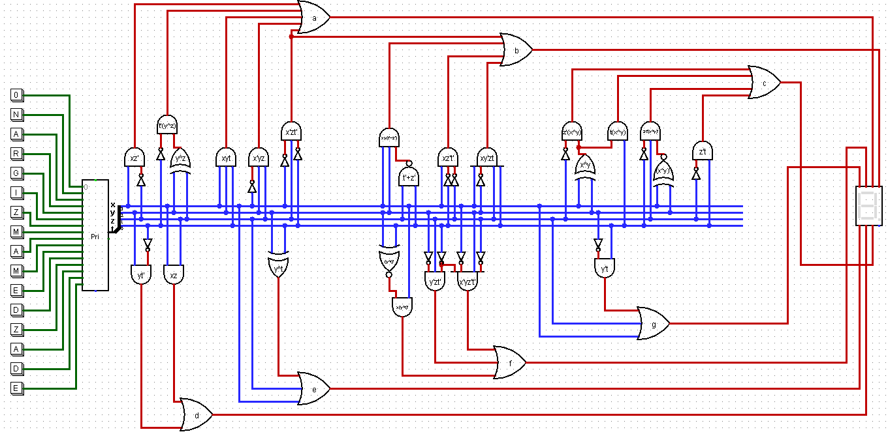
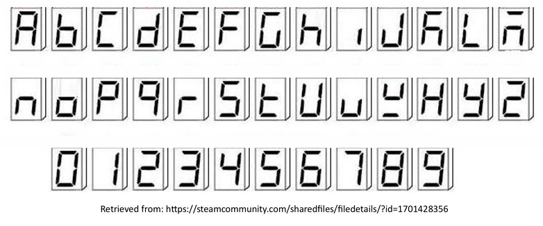

# 7-Segment Name Display in Logisim

This project implements a combinational logic circuit in Logisim that maps encoded button inputs to letters displayed on a 7-segment display.

## Project Objective
This project focuses on designing a combinational logic circuit that takes a 4-bit encoded input and generates the correct outputs for a 7-segment display. Different input combinations are used to represent selected letters, allowing the circuit to display characters from my name and surname.

## How It Works
- Each button corresponds to a specific character
- The encoder converts the selected button into a 4-bit input
- The logic circuit activates the required 7-segment outputs
- The display shows the corresponding letter

## Circuit Screenshot

## Demo Video
[Watch the project demo on YouTube](https://youtu.be/R-bw8leuP9g)

## Project Overview
- Built using combinational logic
- SOP expressions were simplified using Karnaugh maps
- Supporting derivations are available in the [PDF file](kmap-sop-solutions.pdf)
- Implemented in [Logisim](https://sourceforge.net/projects/circuit/)

## References
- [Simple 7-segment Alphabet Display](https://steamcommunity.com/sharedfiles/filedetails/?id=1701428356) — reference used for 7-segment alphabet representation

### 7-Segment Alphabet Reference

